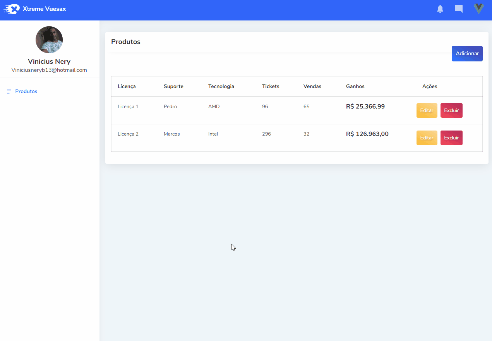

# Products Managment

> O projeto consiste em um sistema de gerenciamento de produtos. Utilizo Laravel no back-end para fornecer a API para o front-end em Vue.js, as requisições são feitas através do axios e o layout é responsivo.



## Instalação

Windows:

Na pasta Back-end execute os seguintes comandos. (Configure o seu .env antes (php artisan key:generate))
```sh
composer install
composer update
php artisan migrate
php artisan serve
```

Na pasta Front-end execute os seguintes comandos.
```sh
npm i
npm run serve
```

## Meta

Vinicius Nery – [@Linkedin](https://www.linkedin.com/in/marcos-nery-a3012/) – Viniciusneryb13@hotmail.com

[https://github.com/Nery37](https://github.com/Nery37)
